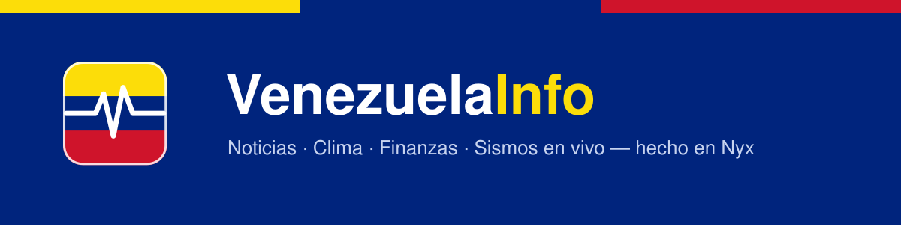

  

  <a href="https://venezuelainfo.org"><b>venezuelainfo.org</b></a> &nbsp;·&nbsp;
  Hecho en <a href="https://nyxlang.com">Nyx</a>

Portal de noticias e información sobre Venezuela: **sismos en vivo**, clima,
finanzas, noticias agregadas, guía de sitios por zona y **chat colectivo en
tiempo real**. Aplicación web instalable (PWA).

---

> ## ⚡ Full-stack en Nyx, de punta a punta
>
> Lo interesante de VenezuelaInfo no es solo lo que hace, sino **con qué está
> hecho**: **cada capa del stack está escrita en [Nyx](https://nyxlang.com)**.
> No hay nginx, ni un framework web de otro lenguaje, ni JavaScript de aplicación,
> ni una base de datos de terceros.
>
> | Capa | En un stack típico | Aquí |
> |------|--------------------|------|
> | **Proxy / TLS** | nginx | **nyx-proxy** — el reverse proxy escrito en Nyx |
> | **Servidor web** | Express, Rails, … | **nyx-serve** — el framework web escrito en Nyx |
> | **Front-end** | React / JavaScript | **Nyx compilado a WebAssembly** |
> | **Base de datos (KV)** | Redis | **nyx-kv** — el key-value escrito en Nyx |
> | **Base de datos (SQL)** | Postgres / SQLite | **nyx-db** — la base SQL relacional escrita en Nyx |
>
> Un request **entra** por un proxy Nyx, lo **atiende y renderiza** un servidor Nyx,
> se **hidrata** en el navegador con **Nyx compilado a WASM**, habla con las APIs
> externas desde Nyx y **persiste** en bases de datos Nyx — un **key-value** (nyx-kv,
> para sesiones y chat) y una **base SQL** (nyx-db, para analítica e histórico de tasas).

---

## Qué ofrece

- 🌎 **Sismos en vivo** — actividad sísmica de Venezuela (FUNVISIS + EMSC) con filtros, orden, mapa y hora local.
- ⛅ **Clima** — pronóstico completo de cualquier ciudad, con geolocalización.
- 💱 **Finanzas** — tipos de cambio con **Dólar/Euro BCV directos del BCV** (tasa de hoy y de mañana), Binance, cripto y Bolsa de Caracas; calculadora con datos de pago guardables.
- 📰 **Noticias** — titulares agregados de medios venezolanos.
- 🧭 **Baquiano** — guía turística de los 24 estados (panorama, destinos, datos prácticos) con fotos y enlaces a mapas.
- 💬 **Chat** — conversación colectiva con salas, en tiempo real.
- 🔔 **Avisos push** — notificaciones (con la app cerrada) de sismos fuertes, cambios de tasa BCV y chat; activables desde el pie de cualquier página, con selección de temas.

Todo servido como **PWA instalable**, con tema claro/oscuro y pensado para móvil.

  🔗 <a href="https://venezuelainfo.org"><b>venezuelainfo.org</b></a>
  &nbsp;·&nbsp; Construido con <a href="https://nyxlang.com"><b>Nyx</b></a>

